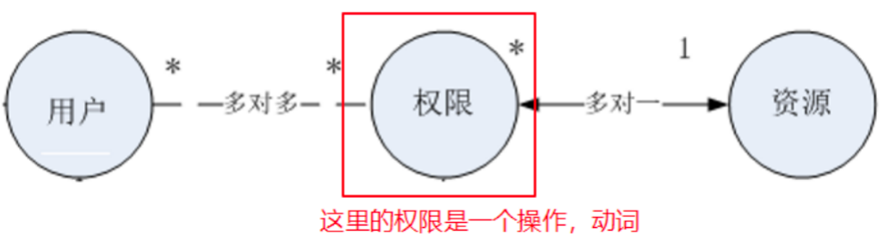
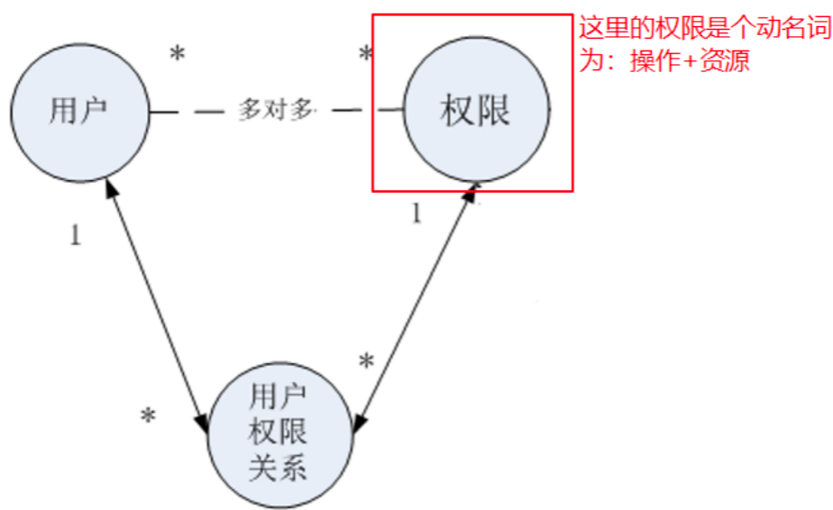
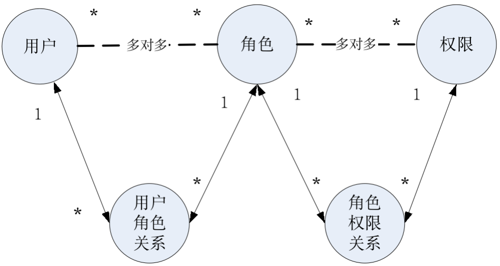

# 权限管理

在学习shiro前，需要先学习权限管理的概念

## 权限管理概念

### 什么是权限管理

权限管理要实现对用户访问系统的控制，按照安全规则或者[安全策略](http://baike.baidu.com/view/160028.htm)控制用户可以访问而且只能访问自己被授权的资源。

只要有用户参与的系统一般都要有权限管理。

权限管理包括用户**身份认证**和**授权**两部分。对于需要访问控制的资源，用户首先经过身份认证，认证通过后用户具有该资源的访问权限方可访问。

### 什么是身份认证

`身份认证`：判断一个用户是否为合法用户的处理过程。

通过一些用户信息去识别用户是否合法，用户是谁，用户的身份是哪个。

常用的用户身份验证的方法：用户名密码方式、指纹、声纹

### 什么是授权

`授权，即访问控制`：控制谁能访问哪些资源。

在用户认证通过后，系统对用户访问资源进行控制，用户只能访问那些具有资源的访问权限的资源

### 关键对象：

subject：原意是主题，主体。 可以理解为用户。当用户,  程序要去访问系统的资源，系统需要对subject进行身份认证。

principal：原意是当事人。可以理解为用户身份信息，通常是唯一的，一个主体还有多个身份信息，但是都有一个主身份信息（primary principal）

credential：凭证信息。 可以是密码 、证书、指纹，声纹。 

**总结：主体在进行身份认证时需要提供身份信息或凭证信息。**

## 权限管理模型

简单的：

进一步简化

上述模型的不足之处在于，需要给每个具体的用户增加其对应的权限。当用户非常多时，每次授权就非常麻烦。

可以再将一组具备相同权限的用户抽象为一个角色

那么可以得到一个**权限管理的通用模型**

通常给用户分配资源权限需要将权限信息持久化，比如存储在关系数据库中。

把用户信息、权限管理、用户分配的权限信息写到数据库（权限数据模型）

